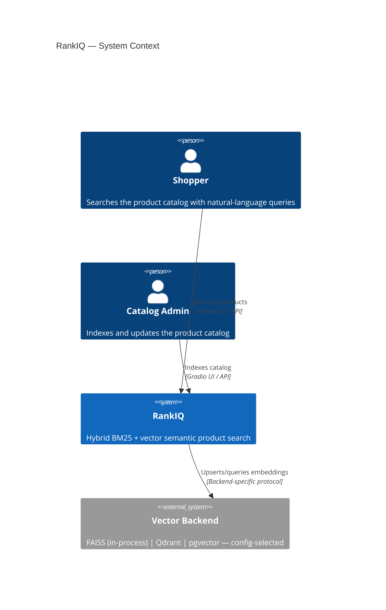
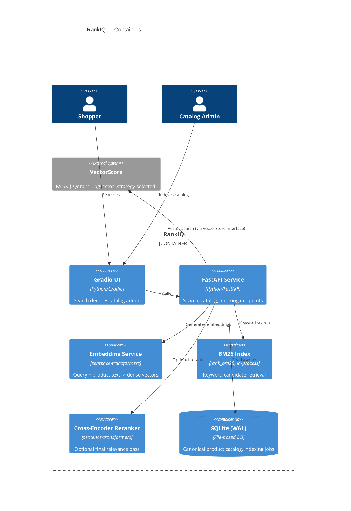
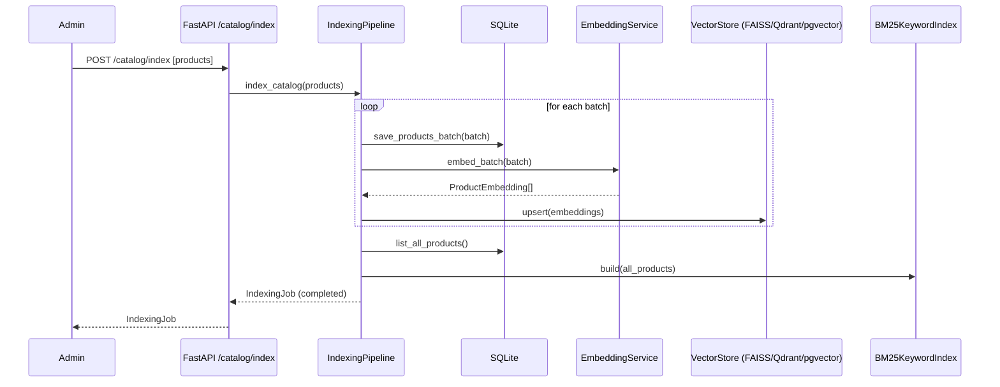
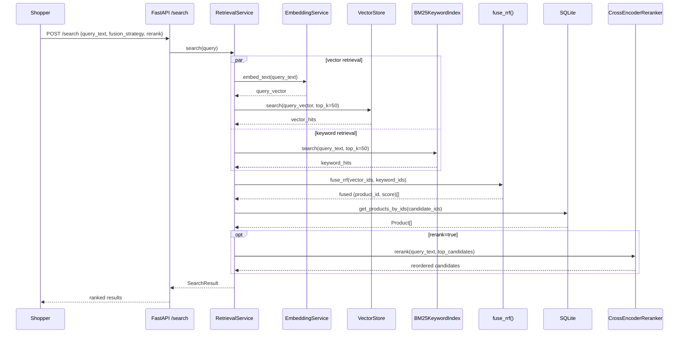
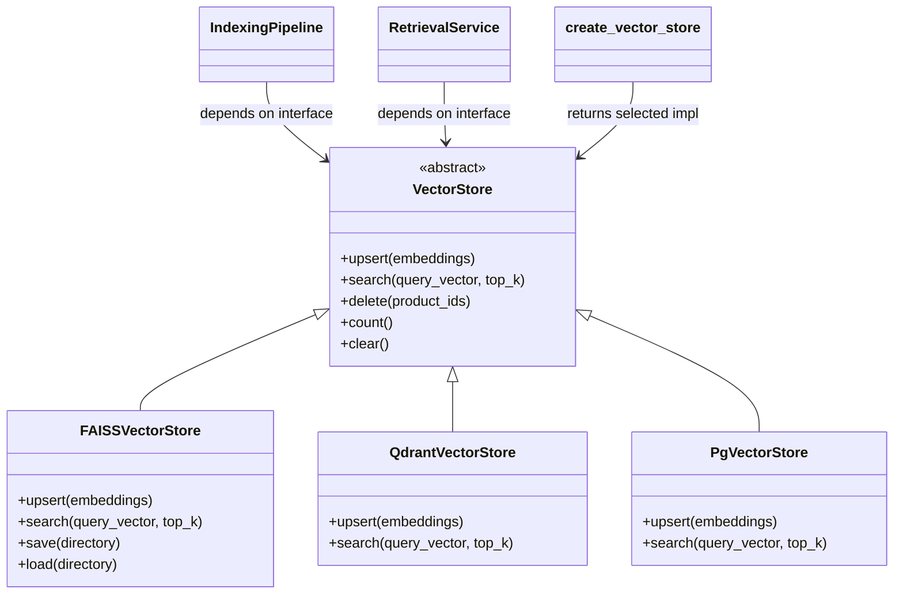
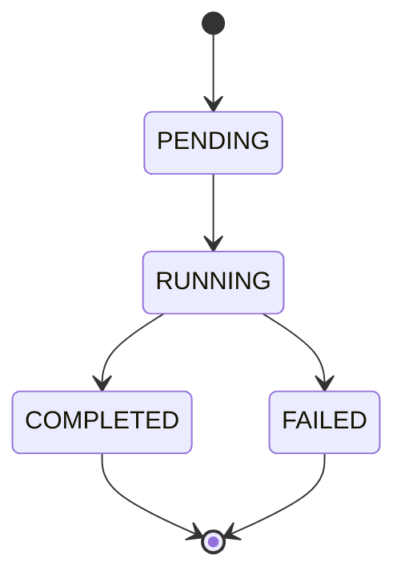

# Architecture Diagrams

## C4 Level 1 — System Context

## C4 Level 2 — Containers

## Indexing Sequence

## Hybrid Search Sequence

## VectorStore Strategy Pattern

## Indexing Job State Machine

